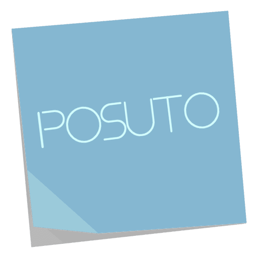
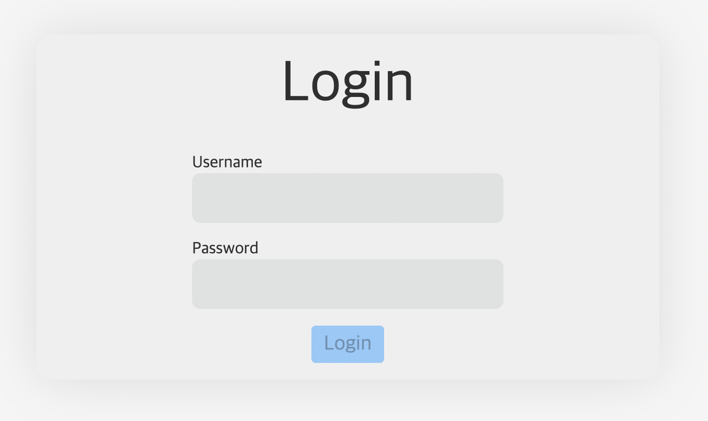
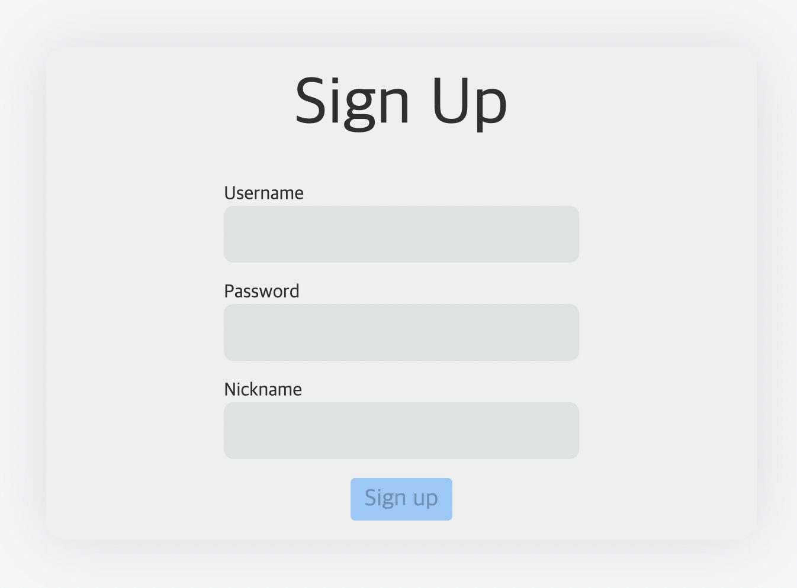
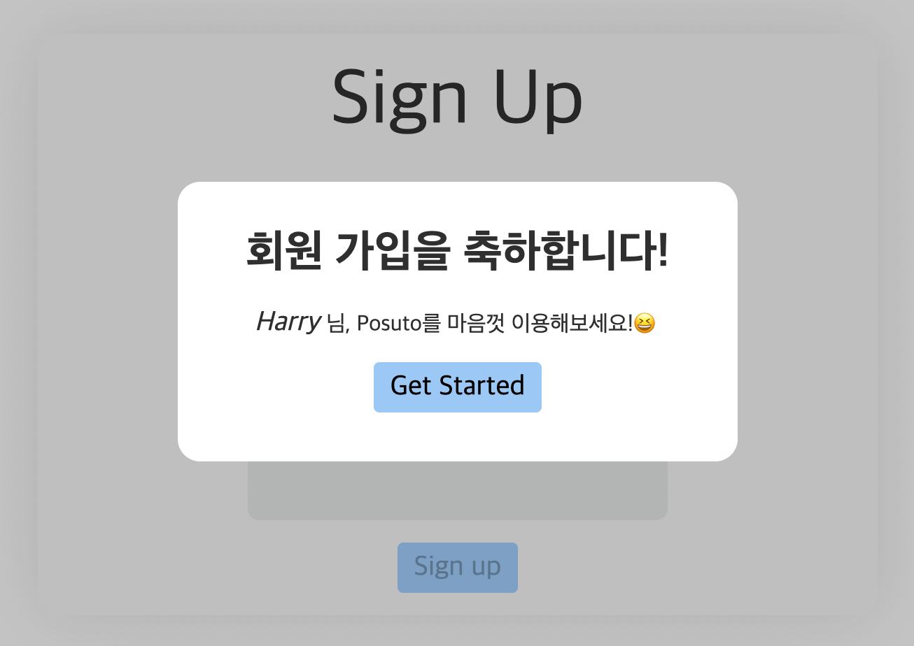
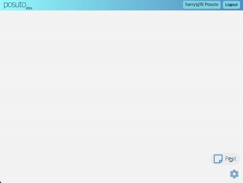
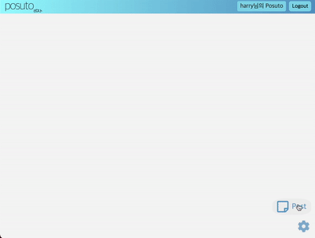

# Posuto(ポスト)
<p align="center">

</p>

*<p align="center">Just post it. <br/>*
배포 : <a href="https://posuto.netlify.app/" target="_blank">https://posuto.netlify.app/</a> </br>
</br>


</br>
*Vue 3 Composition API + Typescript* </br>
Updated works! : [Vue 3 Script Setup + Typescript + VueUse (Version 3.0)](https://github.com/cre4tive97/posuto)
</p>


</br>


Tech Stack : <br/>


</br>
</br>
</br>

## 🤔 Posuto란?

<br/>

- Posuto는 간단한 할 일 기록, TIL 등을 기록하기 위한 포스트잇 어플리케이션 입니다.
- 사랑하는 아내를 위해 기획되었지만, 많은 사람들이 유용하게 사용 가능하게 오픈소스로 배포합니다.
- 기존 온라인 포스트잇 어플리케이션들은, 복잡한 회원가입 구조를 가지고 있고, 사용자 인스턴스를 생성하는데 시간이 소요되기도 합니다.
이러한 복잡한 과정들을 생략하고, 간단한 회원가입과 함께 즉시 사용 가능한 포스트잇 어플리케이션이 있다면 어떨까? 라는 생각으로 개발했습니다.

</br>
</br>

## 🖱 Posuto UI/UX 살펴보기
</br>
<p align="center">

</p>

+ URL 접속시 최초로 보게 될 화면입니다.
+ 계정이 없을 시, 우측 상단의 Signup 버튼을 누르면 회원가입 페이지로 이동합니다.

</br>
<p align="center">

</p>

+ Username은 이메일 형식으로 작성해야 합니다.

</br>
<p align="center">

</p>

- Form이 비어있지 않고, Form Validation의 조건을 만족하면, Signup 버튼이 활성화 됩니다.

</br>

<p align="center">

<p/>

+ 성공적으로 회원가입을 마쳤다면, 귀여운 모달창이 알려줍니다.

<p align="center">

</p>

+ 우측 하단 포스트 버튼을 클릭시, 새로운 Default 포스트가 생성됩니다.
+ 포스트에 마우스를 올리고 수정 버튼을 활성화하면, 포스트가 수정이 가능한 Form 형태가 됩니다.
+ 수정을 마쳤다면, 다시 수정 버튼을 클릭해 비활성화하면, Drag&Drop/Resize 가능한 포스트잇 됩니다.
+ Drag&Drop/Resize 이벤트가 발생시 서버에 PUT 요청을 보내, 유저 포스트의 Position 값을 실시간 저장 합니다.

</br>

<p align="center">

</p>

+ 우측 하단 설정버튼을 클릭시, 포스트잇 배경색을 선택하는 창이 나옵니다.
+ 선택한 배경색은 localStorage에 저장되어 동일한 브라우저에서 유지 가능합니다.

</br>
</br>

## 🛠 기술 스택 & 배포 환경
+ 기술스택
    - Vue.js 2
    - Vue Router
    - Vuex
    - Axios
    - Express
    - MongoDB(mongoose)
+ 배포환경
    - Front-end : Netlify
    - Back-end : Heroku

</br>

## ⚙️ 개발 환경
+ [Chrome](https://www.google.co.kr/chrome/)
+ [Git](https://git-scm.com/downloads)
+ [VSC](https://code.visualstudio.com/)
+ [node.js](https://nodejs.org/ko/)
+ [Vue Dev Tool](https://chrome.google.com/webstore/detail/vuejs-devtools/nhdogjmejiglipccpnnnanhbledajbpd)

</br>

## 📃 라이브러리

</br>

의존성 라이브러리는 [package.json](./posuto/package.json)을 참조해주세요.

</br>

## ⛓ 프론트엔드 소스트리

</br>

```
├── src
   ├── App.vue
   ├── api
   │   └── common
   ├── assets
   ├── components
   │   └── common
   ├── css
   ├── views
   ├── mixins
   ├── routes
   ├── store
   ├── utils
   └── main.js ...

```
### 소스트리 설명

+ 기존 프로젝트들(Eterno, Cocha 등)의 문제중 하나였던 소스트리 구성을 변경했습니다.(inflearn 강의를 참고함)
+ Axios를 이용한 API 호출은 api 폴더에 구성했습니다. API 각각 역할에 따라 유지보수에 용이하게 모듈화 했습니다.
+ 공통된 컴포넌트는 common 폴더에 구성했습니다. 추후 컴포넌트 규모가 커진다면 form, post 등으로 세부적으로 나눌 수 있을 것 같습니다.
+ 라우터에 의해 보여지는 컴포넌트는 views 폴더에 구성했습니다.

</br>
</br>

## 📂 프로젝트를 마치며

</br>

앞서 말씀드린대로, 기존 프로젝트들은 전혀 기술적/구조적 체계가 잡혀있지 않은, 그저 생각나는대로 '무지성' 코딩을 한 프로젝트라면, 이번 프로젝트는 처음으로 체계적으로 구성한 것에 의의가 있다고 생각합니다. </br>
프로젝트를 진행하며 발전한 기술들을 나열하겠습니다.

+ 개발환경 구성
    - Prettier, ESLint 와 configuration 파일들을 개발 환경에 맞게 구성 가능
+ Axios
    - Axios interceptor를 사용해 HTTP 헤더를 configuration
    - API 호출과 이후 작업을 async/await 문법을 이용해 동기적 처리를 보장
    - UX를 고려한 API 호출 시점에 대한 이해
    - API의 역할에 맞게 각각의 파일로 모듈화
+ Vue-Router
    - Webpack의 code splitting을 활용한 lazy loading을 구현
    - Global navigation guard를 활용한 권한 유무 판별
+ REST API
    - REST API로 CRUD 구성
    - JWT/Cookies 를 이용한 인증 분기처리
+ 환경변수
    - production mode 와 development mode 의 차이에 대해 이해하고 활용
+ 구조화
    - 재사용 로직이나, 컴포넌트들을 유지보수가 용이한 폴더트리 구조로 구조화

</br>

아래는 본 프로젝트에서 부족한 부분과 개선이 필요한 점에 대해 나열하겠습니다.


+ Jest를 이용한 유닛테스트에 익숙해져야 함
+ UX를 고려한 에러처리
+ DOM/UI 조작 자바스크립트 코드를 더 간결하게 작성
    - 이중반복, 복잡한 if문 등등 자료구조/알고리즘 공부가 필요해보임.

</br>
</br>

## 📍 Update 
- 최초 접속시 서비스 이용 가이드를 적은 디폴트 포스트를 생성해 UX를 개선했습니다. (Version 1.0 done)
- Vue3 + Typescript 마이그레이션 완료. (Version 2.0 done)

</br>
</br>

## 📂 Version
- [Version 1.0](https://github.com/cre4tive97/posuto-vue2)
- [Version 3.0](https://github.com/cre4tive97/posuto)

## 🔑 License
</br>
</br>

[MIT License](./LICENSE)